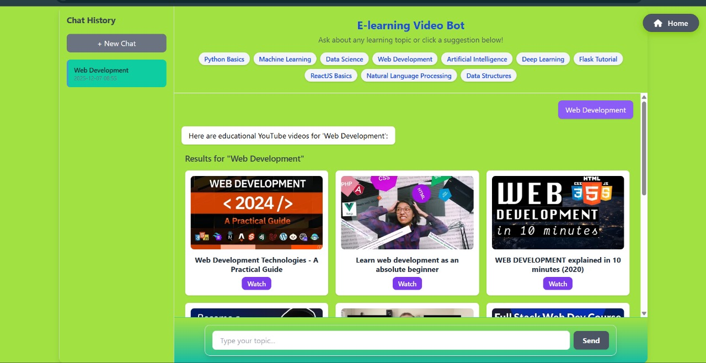

# E-learning Video Recommendation System

An AI-powered web application that recommends the best YouTube videos for any learning topic. Built with Flask, it leverages the [SerpApi](https://serpapi.com/) YouTube Search API to fetch up-to-date video recommendations based on user queries.

## Features
- **Instant YouTube Video Recommendations:** Get top video picks for any topic.
- **Modern UI:** Responsive, visually appealing interface using Tailwind CSS.
- **Predefined & Custom Topics:** Choose from popular topics or enter your own.
- **No Sign-up Required:** Start learning immediately.

## Demo
 

## How It Works
1. User selects or enters a topic.
2. The app queries SerpApi's YouTube engine for relevant videos.
3. Top results are displayed with thumbnails and direct links.

## Getting Started

### Prerequisites
- Python 3.7+
- [SerpApi API Key](https://serpapi.com/)


### Running the App
```bash
python app.py
```


## File Structure
```
├── app.py               # Main Flask application
├── requirements.txt     # Python dependencies
├── templates/
│   ├── home.html        # Landing page
│   └── bot.html         # Chat and video recommendations UI
```

## SerpApi Integration
- The app uses SerpApi's YouTube engine to fetch video results.
- [SerpApi Documentation](https://serpapi.com/youtube-search-api)
- You need a valid SerpApi API key to use this feature.

## Customization
- **Topics:** Edit the `TOPICS` list in `app.py` to add/remove default topics.
- **Styling:** Modify the HTML templates in `templates/` for UI changes.
- **API Key Security:** For production, avoid hardcoding API keys. Use environment variables or a secrets manager (not implemented in this version).

## Dependencies
- Flask
- requests
- pymongo *(not used in current code, but listed in requirements)*

## License
MIT License

## Acknowledgments
- [SerpApi](https://serpapi.com/) for the YouTube Search API
- [Tailwind CSS](https://tailwindcss.com/) for UI styling 
